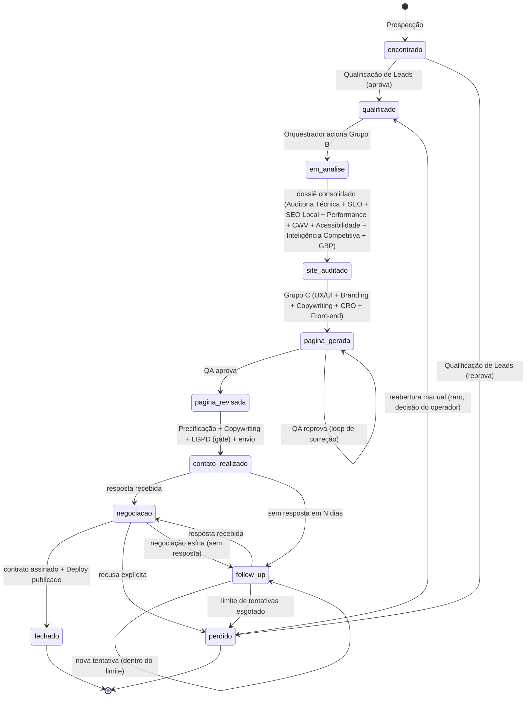
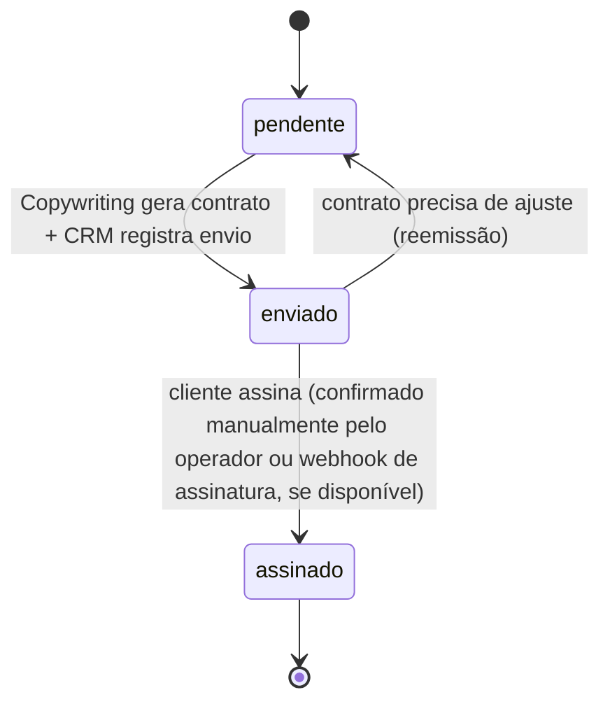
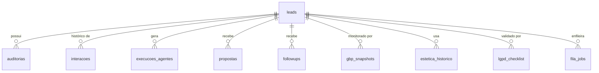

# CRM.md — Modelagem do Ciclo Comercial (Etapa 4 de 7)

**Depende de:** `docs/PRD.md` (Etapa 1), `docs/AGENTES.md` (Etapa 2) e
`docs/ARQUITETURA_TECNICA.md` (Etapa 3) — todos aprovados. Este documento
formaliza o CRM como **fonte única de verdade do ciclo comercial** (RF-12):
máquina de estados completa, campos obrigatórios por estado, relações entre
entidades, regras de validação de transição e as visões do dashboard.
Nenhum código foi alterado para produzir este documento.

Status: **aguardando aprovação**.

---

## 1. Papel do agente CRM nesta modelagem

Todo o conteúdo abaixo é **propriedade e responsabilidade exclusiva do
agente CRM** (`AGENTES.md` §21): é ele quem valida e persiste cada
transição descrita aqui, a pedido do Orquestrador, com os dados agregados
dos demais agentes. Nenhum outro agente escreve diretamente nas tabelas
descritas em `ARQUITETURA_TECNICA.md` §4 — eles apenas devolvem o payload
`dados_para_crm` do contrato padrão (`AGENTES.md` §0.4).

## 2. Máquina de estados do lead

### 2.1 Estados válidos

`encontrado · qualificado · em_analise · site_auditado · pagina_gerada ·
pagina_revisada · contato_realizado · negociacao · follow_up · fechado ·
perdido`

### 2.2 Diagrama de transições

### 2.3 Tabela de transições (pré-condições, agente responsável, efeito colateral)

| De | Para | Pré-condição obrigatória | Agente que valida/aciona | Efeito colateral gravado |
|---|---|---|---|---|
| — | `encontrado` | Candidato coletado pela Prospecção, sem duplicata no CRM | Prospecção → CRM | Nova linha em `leads`; `interacoes` (de=NULL) |
| `encontrado` | `qualificado` | Veredito de qualificação = aprovado | Qualificação de Leads → CRM | `interacoes` com motivo |
| `encontrado` | `perdido` | Veredito de qualificação = reprovado | Qualificação de Leads → CRM | `interacoes` com motivo (`motivo_perda = "nao_qualificado"`) |
| `qualificado` | `em_analise` | Nenhuma auditoria pendente já em execução para o mesmo lead (evita duplicidade) | Orquestrador → CRM | `execucoes_agentes` para cada agente do Grupo B disparado |
| `em_analise` | `site_auditado` | Todos os agentes do Grupo B retornaram `status != erro` (ao menos um `precisa_input_humano` bloqueia a transição) | CRM (checagem agregada) | `auditorias` (uma linha por tipo) |
| `site_auditado` | `pagina_gerada` | Dossiê (`auditorias`) existente e recente (janela de cache — `ARQUITETURA_TECNICA.md` §6) | Front-end (última etapa do Grupo C) → CRM | Arquivos `pagina.html`, `pagina-editor.html`, `comparar.html` gravados |
| `pagina_gerada` | `pagina_revisada` | Veredito de QA = aprovado | QA → CRM | `interacoes` |
| `pagina_gerada` | `pagina_gerada` (loop) | Veredito de QA = reprovado | QA → CRM | `interacoes` com lista de motivos; Orquestrador reaciona agente responsável |
| `pagina_revisada` | `contato_realizado` | LGPD = aprovado (gate obrigatório, RF-16) **e** `propostas.valor_setor` definido pela Precificação | LGPD (gate) + Precificação + Copywriting → CRM | `propostas` (nova linha, `enviado_em`); e-mail enviado via conector Gmail |
| `pagina_revisada` | `pagina_revisada` (bloqueio) | LGPD = bloqueado | LGPD → CRM | Nenhuma transição; `lgpd_checklist.aprovado = 0` registrado, operador notificado |
| `contato_realizado` | `negociacao` | Resposta detectada (Follow-up/Gmail) | Follow-up → CRM | `propostas.respondido_em` |
| `contato_realizado` | `follow_up` | N dias sem resposta (configurável, default herdado da v2) | Follow-up → CRM | `followups` (nova tentativa) |
| `follow_up` | `negociacao` | Resposta detectada | Follow-up → CRM | `followups.respondido = 1` |
| `follow_up` | `perdido` | Nº de tentativas ≥ limite configurado | Follow-up → CRM | `motivo_perda = "sem_resposta"` |
| `negociacao` | `fechado` | Contrato assinado (`contratoStatus = assinado`) **e** Deploy confirmou HTTPS válido | Deploy + CRM | `https_validado_em`, `contratoEm` |
| `negociacao` | `perdido` | Recusa explícita do cliente final | Follow-up/operador → CRM | `motivo_perda` (catálogo §6) |
| `negociacao` | `follow_up` | Negociação sem movimento por N dias | Follow-up → CRM | Nova tentativa de reaquecimento |
| `perdido` | `qualificado` | Decisão manual do operador (reabertura) | Orquestrador (comando explícito do operador) → CRM | `interacoes` com `motivo = "reaberto_manualmente"` |

**Regra geral de validação (CRM):** nenhuma transição fora desta tabela é
aceita — se o Orquestrador pedir uma transição sem pré-condição satisfeita,
o agente CRM **rejeita** e devolve `status: bloqueado` com o motivo (RF-03,
`AGENTES.md` §21).

## 3. Campos obrigatórios por estado

| Estado | Campos que devem estar preenchidos em `leads` (além dos sempre presentes: `slug, nome, nicho, cidade, status`) |
|---|---|
| `encontrado` | `nota, avaliacoes, siteAntigo` (se existir), contato público (`email` ou `whatsapp`) |
| `qualificado` | + `motivo` (justificativa da Qualificação) |
| `em_analise` | + nenhum campo novo obrigatório em `leads` (dados vivem em `auditorias`) |
| `site_auditado` | + ao menos uma linha em `auditorias` por tipo do Grupo B |
| `pagina_gerada` | + `urlNova` (caminho local do arquivo, ainda não publicado) |
| `pagina_revisada` | + veredito de QA registrado em `interacoes` |
| `contato_realizado` | + `dataProposta`, `valor_setup`, `manutencao`, linha em `propostas`, `lgpd_status = aprovado` |
| `negociacao` | + evento de resposta em `propostas.respondido_em` |
| `follow_up` | + linha em `followups` |
| `fechado` | + `contratoStatus = assinado`, `pago` atualizado, `https_validado_em`, `vps_dominio` |
| `perdido` | + `motivo` preenchido com um valor do catálogo (§6) |

## 4. Sub-máquina: contrato (`contratoStatus`)

Independente do estado principal do lead (roda em paralelo a partir de
`negociacao`):

`pago` (0/1) e `manutencao` (valor recorrente) são independentes do
`contratoStatus` — um contrato pode estar `assinado` e ainda não `pago`
(ex.: cobrança agendada para o mês seguinte). Este desenho já existia na v2
e é preservado sem alteração de semântica.

## 5. Relacionamentos (modelo de dados)

Todas as tabelas referenciam `leads.slug` como chave estrangeira lógica
(SQLite sem enforcement estrito de FK, mesma prática já usada na v2). O
schema físico completo destas tabelas está em `ARQUITETURA_TECNICA.md` §4.

## 6. Catálogo de motivos de perda (`motivo` quando `status = perdido`)

Padronizado para permitir análise agregada (alimenta Analytics/Relatórios):

- `nao_qualificado` — reprovado ainda na Qualificação de Leads.
- `sem_resposta` — esgotou tentativas de follow-up sem retorno.
- `recusa_explicita` — cliente final recusou a proposta.
- `preco` — cliente final recusou por valor.
- `concorrencia` — cliente final fechou com concorrente (quando informado).
- `fora_do_escopo` — lead não é viável tecnicamente (ex.: exige integração
  fora do que a plataforma cobre).
- `outro` — com `obs` preenchido obrigatoriamente explicando o motivo real.

## 7. Regras de negócio e validação

1. **Só o agente CRM persiste.** Confirmado em `AGENTES.md` §0.2/§21 —
   reafirmado aqui como regra do domínio de dados, não só de arquitetura.
2. **QA é a única aprovação de qualidade de página.** Nenhum outro agente
   pode mover `pagina_gerada → pagina_revisada` (RF-10).
3. **LGPD é gate bloqueante, não consultivo.** Uma reprovação de LGPD
   impede fisicamente a transição para `contato_realizado` — não é uma
   recomendação que o Orquestrador pode ignorar (RF-16).
4. **Idempotência de publicação.** Uma segunda execução de Deploy sobre um
   lead já `fechado` deve ser tratada como **republicação** (atualiza
   `https_validado_em`), nunca como nova transição de estado (RNF-05).
5. **Reabertura de `perdido` é sempre manual.** Nenhum agente reabre um
   lead perdido automaticamente — só o operador, via comando explícito ao
   Orquestrador (evita reprocessamento indevido de leads descartados).
6. **Toda transição gera uma linha em `interacoes`.** Sem exceção — é o que
   sustenta a auditabilidade exigida em RNF-04/RNF-10.

## 8. Visões do dashboard (evolução das já existentes na v2)

| Visão | Status na v2 | Evolução na v3 |
|---|---|---|
| Kanban (por `status`) | Existe (`dashboard-template.html`) | Atualizado para os 11 estados desta Etapa 4 (a v2 tinha um pipeline mais curto) |
| Funil | Existe | Mantido, agora com taxa de conversão por etapa alimentando as Métricas de Sucesso do PRD §15 |
| Financeiro (recebido/a receber, MRR, projeção 12 meses) | Existe | Mantido sem alteração de lógica; passa a ler `valor_setup` + `manutencao` separadamente |
| Contratos (`contratoStatus`, `pago`) | Existe | Mantido |
| **Execuções** (novo) | — | Nova aba, lê `/api/execucoes` (`ARQUITETURA_TECNICA.md` §8.3/§10) — mostra quais agentes rodaram por lead |
| **Auditoria/Diagnóstico** (novo) | — | Nova aba, lê `/api/auditorias/<slug>` — mostra o dossiê consolidado do Grupo B por lead |
| **LGPD** (novo) | — | Nova aba, lê `/api/lgpd/<slug>` — mostra o checklist de conformidade e eventuais bloqueios |

## 9. Métricas financeiras derivadas (sem mudança de fórmula em relação à v2)

- **Ticket médio de setup** = média de `valor_setup` entre leads `fechado`.
- **MRR** = soma de `manutencao` entre leads `fechado` com `pago = 1`.
- **Projeção 12 meses** = MRR atual × 12 (mesma lógica simplificada já usada
  no dashboard da v2 — refinamento de projeção não é escopo desta v3).
- **Taxa de fechamento** = `fechado` / (`fechado` + `perdido`), consumida
  pelas Métricas de Sucesso do PRD §15.

---

## Próximos passos

Mediante aprovação deste documento, a Etapa 5 (`MEMORIA.md`) detalha os
tipos de memória (temporária, por execução, do lead, compartilhada, do
projeto, histórico, embeddings/RAG, versionamento de contexto) com base nas
tabelas e nos fluxos já formalizados nesta Etapa 4.
