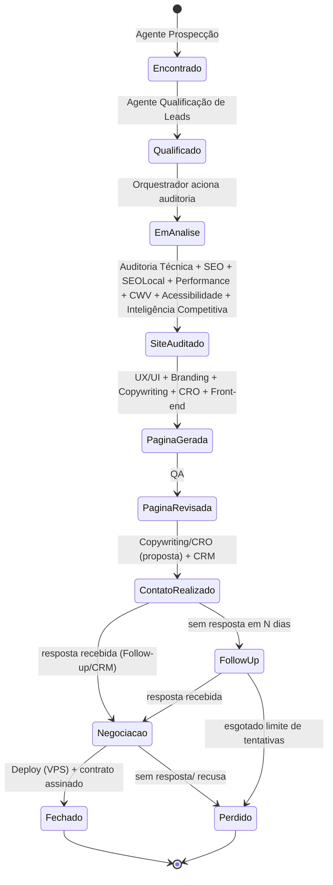
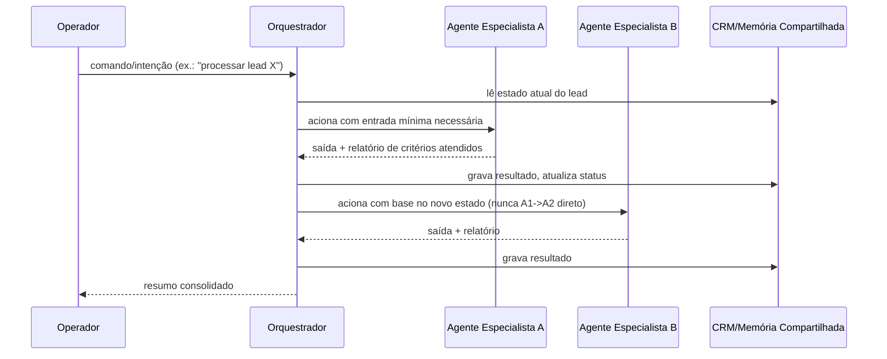

# PRD — PROSPECTOR-DE-SITES v3: Plataforma Multi-Agente

**Etapa 1 de 7 do plano de evolução.** Este documento é o Product
Requirements Document da evolução do plugin PROSPECTOR-DE-SITES para uma
plataforma composta por um Agente Orquestrador e agentes especialistas
nativos ao Claude Code. **Nenhuma linha de código do plugin atual foi
alterada para produzir este documento.** As Etapas 2–7 (arquitetura
multi-agente detalhada, arquitetura técnica, CRM, memória, prompts e plano
de implementação incremental) só começam após aprovação explícita deste PRD.

Status: **aprovado**.

---

## 1. Visão do Produto

O PROSPECTOR-DE-SITES é hoje um plugin de Claude Code/Cowork que permite a um
único operador (um freelancer ou pequena agência de web design) prospectar,
qualificar, redesenhar e vender sites para pequenos negócios locais no
Brasil, tudo dentro de uma sessão de chat. A visão para a v3 é transformá-lo
em uma **plataforma multi-agente profissional**: um Agente Orquestrador que
decide dinamicamente quais especialistas acionar em cada etapa do ciclo
comercial, cada um operando com escopo estrito, contexto isolado e critérios
de qualidade próprios — elevando o produto de "checklist de chat" para
"esteira de produção assistida por IA" com rastreabilidade de ponta a ponta,
sem exigir infraestrutura de servidor própria.

## 2. Problema

**2.1 Problema de negócio.** O fluxo atual (9 `commands` sequenciais, todos
executados na mesma sessão de chat) mistura responsabilidades muito
diferentes — prospecção, julgamento de qualidade de site, copy, design,
deploy, cobrança — num único "cérebro" de contexto. Isso já foi observado no
código real: por exemplo, o skill `redesign-premium` sozinho acumula
extração de conteúdo, decisão de paleta/tipografia, geração de HTML/CSS e
geração de um editor visual, tudo em uma única instrução monolítica. O
resultado prático é degradação de qualidade em sessões longas, inconsistência
entre execuções (o mesmo comando produz resultados de qualidade variável
dependendo do que já foi discutido na sessão) e nenhuma forma de auditar
*por que* um agente tomou uma decisão específica.

**2.2 Problema técnico (achados da exploração do código).**
- **Não existe orquestração real.** Grep por `agent|orchestrat|prompt` no
  repositório não retorna nenhuma implementação — os 9 `commands/*.md` são
  instruções de linguagem natural para o próprio Claude seguir em sequência,
  não agentes com contrato de entrada/saída.
- **Drift de hospedagem já presente no código.** `commands/setup.md` coleta
  campos de VPS/nginx (host, porta, usuário SSH, path), mas o skill
  efetivamente implementado é `skills/deploy-hostgator` (cPanel/FTP), e
  `dashboard-server.py` lê `cfg.get('hostgator', {})`. Ou seja, o produto já
  começou uma migração para VPS e não terminou — isso vira decisão de produto
  nesta v3 (ver §17.1).
- **LGPD ausente.** O sistema coleta e armazena e-mail, WhatsApp, e por vezes
  CPF/CNPJ de leads e clientes em `prospector-config.json` e no SQLite local
  em texto plano, sem qualquer menção a bases legais, retenção ou
  minimização de dados.
- **Sem SEO, acessibilidade, Core Web Vitals, analytics ou inteligência
  competitiva.** O redesign de sites hoje otimiza apenas para estética e
  variedade visual (via `ui-ux-pro-max-cli`), sem nenhum critério técnico de
  performance, semântica ou rastreamento de resultado pós-publicação.
- **CRM funcional, mas isolado.** O dashboard (`dashboard-server.py`,
  porta 8765, SQLite `leads`) é a peça mais madura do sistema, mas não é
  alimentado nem lido por nenhum "agente" — é só uma tela que outro humano
  edita manualmente ou que os comandos atualizam via `UPDATE` direto.

## 3. Objetivos

1. Introduzir um **Agente Orquestrador** que decide dinamicamente quais
   agentes especialistas acionar por lead/etapa, evitando carregar contexto
   irrelevante em qualquer execução.
2. Decompor as responsabilidades hoje concentradas em 9 commands/6 skills em
   **agentes especialistas com fronteiras estritas** (ver PRD §10 e o futuro
   `AGENTES.md`), nenhum deles assumindo responsabilidade de outro.
3. Fechar as lacunas de domínio identificadas no código atual: SEO, SEO
   local, acessibilidade, Core Web Vitals, performance, LGPD, analytics,
   inteligência competitiva, Google Business Profile — hoje inexistentes.
4. Resolver definitivamente o drift HostGator/VPS: o deploy passa a ser em
   **VPS própria** (SSH/nginx/Let's Encrypt), com o fluxo de cPanel/FTP
   descontinuado.
5. Elevar o CRM de "tela isolada" a **fonte de verdade do ciclo comercial**,
   lida e escrita por todos os agentes através do Orquestrador (nunca
   diretamente entre agentes).
6. Tornar o sistema **auditável**: toda decisão de agente é rastreável (qual
   agente, quais entradas, qual critério de aceite aplicado, quando).
7. Reduzir consumo de tokens/contexto por lead processado, via isolamento de
   contexto por agente e reuso de memória compartilhada em vez de
   re-explicação a cada execução.

**Não-objetivos (fora de escopo da v3):**
- Não criar um backend HTTP próprio, banco de dados externo (Postgres/etc.)
  ou serviço sempre-ligado fora do Claude Code (decisão confirmada:
  arquitetura nativa ao Claude Code).
- Não expandir para fora do Brasil/pt-BR nesta versão.
- Não construir um app mobile ou uma UI própria além do dashboard local
  existente (que será evoluído, não substituído).
- Não migrar leads/clientes existentes de outras ferramentas de CRM externas.

## 4. Público-alvo

Profissionais e pequenas agências de desenvolvimento web/design que vendem
sites sob encomenda para pequenos negócios locais no Brasil, operando via
Claude Code/Cowork, tipicamente como operação solo ou de equipe muito
pequena (1–3 pessoas), sem equipe de engenharia própria e sem apetite para
manter infraestrutura complexa.

## 5. ICP (Ideal Customer Profile) — do operador da plataforma

- Freelancer ou micro-agência de web design/marketing digital no Brasil.
- Já usa (ou está dispost@ a usar) Claude Code/Cowork no dia a dia.
- Prospecta ativamente pequenos negócios locais (clínicas, consultórios,
  escritórios, serviços) com site desatualizado ou inexistente.
- Possui ou está disposto a contratar uma **VPS própria** para hospedar os
  sites produzidos (decisão de produto: não depende mais de HostGator).
- Tem conta Google (Gmail/Drive) para propostas e planilhas, e idealmente
  acesso ao Google Business Profile dos leads/clientes.
- Sensível a custo operacional: prefere uma solução que rode dentro do
  Claude Code a manter servidores e assinaturas de SaaS adicionais.

## 6. Personas

**P1 — "Operador Solo" (persona primária).** Freelancer de web design,
opera o Cowork diariamente, executa prospecção e vendas sozinho, quer
previsibilidade e menos retrabalho manual entre redesign e publicação. Dor
principal: perde tempo revisando o resultado dos comandos por
inconsistência de qualidade entre execuções.

**P2 — "Sócio Comercial/Fechador".** Não opera o Claude Code diretamente,
mas consome o dashboard/CRM para acompanhar funil, decidir descontos e
assinar contratos. Dor principal: falta de visibilidade sobre por que um
lead está "travado" numa etapa.

**P3 — "Cliente Final" (dono do pequeno negócio, lead/cliente).** Não
interage com a plataforma diretamente; recebe e-mails de proposta,
follow-up e o site publicado. Persona passiva, mas central para os
critérios de qualidade de Copywriting, CRO, Branding e LGPD (é o titular
dos dados tratados).

## 7. Casos de Uso

**UC1 — Prospecção com qualificação automática.** Operador aciona o
Orquestrador pedindo leads em um nicho/cidade; Orquestrador aciona
Prospecção e, para cada candidato, Qualificação de Leads antes de gravar no
CRM — hoje isso é um único passo manual dentro do skill `prospeccao-maps`,
sem separação entre "encontrar" e "qualificar".

**UC2 — Auditoria técnica completa de um lead.** Para um lead qualificado,
o Orquestrador aciona em paralelo/sequência (conforme dependência): Auditoria
Técnica, SEO, SEO Local, Performance, Core Web Vitals, Acessibilidade e
Inteligência Competitiva — produzindo um dossiê consolidado que hoje não
existe (o sistema atual só julga "parece datado?" visualmente).

**UC3 — Redesign multi-especialista.** UX/UI, Branding, Copywriting, CRO e
Front-end colaboram (via Orquestrador, nunca diretamente) na página final;
QA valida antes de liberar; hoje isso é um único prompt monolítico no skill
`redesign-premium`.

**UC4 — Publicação em VPS própria.** Deploy aciona SSH/nginx/Let's Encrypt
na VPS do operador/cliente, substituindo o fluxo atual de FTP/cPanel do
HostGator (incluindo o fallback de agendador local hoje usado, que será
redesenhado para o novo alvo na Etapa 3/7).

**UC5 — Proposta, follow-up e fechamento com CRM como fonte de verdade.**
Copywriting/CRO geram a proposta; CRM registra o envio; Follow-up é agendado
via Routine/trigger do Claude Code (recurso já disponível no ambiente) em vez
do polling manual de Gmail feito hoje pelo comando `/respostas`.

**UC6 — Monitoramento de Google Business Profile.** Novo domínio (hoje
inexistente): agente dedicado a acompanhar avaliações/posições do GBP do
lead antes e depois do redesign, alimentando Inteligência Competitiva e
Relatórios.

**UC7 — Geração de relatório de resultado para o cliente final.** Agente de
Geração de Relatórios consolida métricas (Performance, CWV, SEO,
Acessibilidade, Analytics) em um relatório apresentável, hoje inexistente.

**UC8 — Conformidade LGPD auditável.** Agente de LGPD valida, antes de
qualquer envio de proposta/contrato, que os dados pessoais coletados têm
base legal e retenção definidas — hoje não há nenhuma verificação desse tipo.

## 8. Fluxos Completos

### 8.1 Fluxo do lead (pipeline comercial)

Este é o pipeline que o futuro `CRM.md` (Etapa 4) modelará em detalhe
(schema, transições válidas, campos por estado).

### 8.2 Fluxo de comunicação Orquestrador ↔ Agentes

Regra arquitetural inegociável (confirmada pelo usuário): **agentes nunca se
comunicam diretamente**; toda entrada/saída passa pelo Orquestrador e pelo
CRM/memória compartilhada. O detalhamento técnico de como isso mapeia para
o mecanismo real de subagents do Claude Code é objeto da Etapa 2
(`AGENTES.md`) e Etapa 3 (`ARQUITETURA_TECNICA.md`).

## 9. Requisitos Funcionais

Organizados por domínio; o detalhamento por agente (entradas/saídas/
ferramentas/critérios) é objeto da Etapa 2 (`AGENTES.md`). Aqui ficam os
requisitos observáveis do produto.

| ID | Requisito |
|----|-----------|
| RF-01 | O Orquestrador deve decidir dinamicamente, a partir do estado do lead no CRM, quais agentes acionar, sem exigir que o operador especifique manualmente cada etapa. |
| RF-02 | Cada agente deve poder ser acionado isoladamente pelo Orquestrador para reprocessar uma única etapa (ex.: só SEO) sem re-executar o pipeline inteiro. |
| RF-03 | O sistema deve manter o pipeline de status do lead (§8.1) persistido no CRM, com histórico de transições. |
| RF-04 | A Prospecção deve continuar suportando busca por nicho/cidade via Google Maps (via Claude in Chrome), preservando os filtros já validados (nota ≥4.7, ≥40 avaliações) como *default configurável*, não fixo. |
| RF-05 | A Qualificação de Leads deve ser uma etapa distinta da Prospecção, com seus próprios critérios (ex.: existência de e-mail público, qualidade do site atual) documentados e auditáveis. |
| RF-06 | A Auditoria Técnica de Sites deve produzir um relatório estruturado (não apenas texto livre) reutilizável pelos agentes de SEO, Performance, CWV e Acessibilidade. |
| RF-07 | SEO e SEO Local devem ser agentes distintos, com critérios próprios (SEO: on-page/técnico geral; SEO Local: NAP consistency, schema LocalBusiness, Google Business Profile). |
| RF-08 | O agente de Google Business Profile deve poder operar independentemente do fluxo de redesign (ex.: monitorar avaliações de um cliente já fechado). |
| RF-09 | UX/UI, Branding, Copywriting, CRO e Front-end devem poder ser acionados isoladamente para revisar apenas uma dimensão de uma página já gerada, sem regenerar tudo. |
| RF-10 | O QA deve ser o único agente com autoridade para aprovar a transição `PaginaGerada → PaginaRevisada`; nenhum outro agente pode auto-aprovar seu próprio trabalho. |
| RF-11 | O Deploy deve publicar em VPS própria via SSH, com verificação de HTTPS/certificado antes de marcar o lead como `Fechado`/publicado (equivalente ao check de AutoSSL que já existe hoje para HostGator, portado para o novo alvo). |
| RF-12 | O CRM deve ser a única fonte de verdade de estado lida por todos os agentes; nenhum agente mantém estado de negócio fora dele. |
| RF-13 | O Follow-up deve ser agendável (ex.: via Routine/trigger do Claude Code) sem exigir que o operador rode um comando manualmente todos os dias. |
| RF-14 | A Inteligência Competitiva deve comparar o lead com concorrentes do mesmo nicho/cidade (achados hoje inexistentes no produto). |
| RF-15 | Performance, Core Web Vitals e Acessibilidade devem ser agentes distintos (métricas e ferramentas diferentes), mas alimentar um relatório único via Geração de Relatórios. |
| RF-16 | O agente de LGPD deve validar, antes de qualquer envio externo (proposta/contrato), que os dados pessoais tratados têm finalidade e retenção documentadas; deve poder **bloquear** o envio se a validação falhar. |
| RF-17 | Analytics deve registrar eventos de funil (proposta enviada, aberta, respondida) reaproveitando os conectores já usados (Gmail) sem exigir nova infraestrutura. |
| RF-18 | Geração de Relatórios deve produzir um artefato apresentável ao cliente final (site/PDF/HTML), consolidando saídas de outros agentes, sem duplicar lógica de análise já feita por eles. |
| RF-19 | O sistema deve manter compatibilidade com os dados já existentes em instalações atuais (`prospector.db`, `prospector-config.json`) via migração aditiva (sem *breaking change* silencioso). |
| RF-20 | Toda ação de um agente deve gerar um registro auditável (o quê, quando, com qual entrada, qual critério de aceite), acessível pelo Orquestrador e pelo operador. |

## 10. Agentes mínimos (mapeamento preliminar — detalhado na Etapa 2)

Orquestrador · Prospecção · Qualificação de Leads · Auditoria Técnica de
Sites · UX/UI · Branding · SEO · SEO Local · Copywriting · CRO · Front-end ·
QA · CRM · Follow-up · Inteligência Competitiva · Google Business Profile ·
Performance · Core Web Vitals · Acessibilidade · LGPD · Analytics · Geração
de Relatórios · Deploy.

**Agentes adicionais propostos (a confirmar/justificar em detalhe na Etapa
2):**
- **Precificação/Proposta Comercial** — separado de Copywriting: decide
  valor/pacote com base no dossiê de auditoria, enquanto Copywriting só
  redige; hoje misturados implicitamente no skill `proposta-email`.
- **Governança de Prompts/Qualidade** — dono da consistência dos prompts de
  sistema/operacionais dos demais agentes (Etapa 6), evitando que cada
  agente evolua seu prompt de forma isolada e incoerente.
- **Onboarding/Configuração** — hoje é o comando `/setup`; torna-se agente
  próprio pois define parâmetros que todos os outros consomem (niche, cidade,
  credenciais de VPS, assinatura), sem se misturar com Prospecção.

## 11. Requisitos Não Funcionais

| ID | Requisito |
|----|-----------|
| RNF-01 | **Contexto/custo**: cada agente deve operar com o menor contexto necessário; o Orquestrador não deve repassar histórico irrelevante a um agente. |
| RNF-02 | **Privacidade/LGPD**: dados pessoais de leads/clientes (e-mail, telefone, CPF/CNPJ quando presente) devem ter tratamento documentado (finalidade, retenção, minimização); nada em texto plano além do estritamente necessário. |
| RNF-03 | **Segurança de credenciais**: credenciais de VPS (SSH) não podem ser armazenadas em texto plano sem controle de acesso — hoje `prospector-config.json` guarda a senha do HostGator em texto plano; a v3 deve ao menos avaliar alternativa (ex.: chave SSH em vez de senha). |
| RNF-04 | **Auditabilidade**: qualquer decisão relevante (qualificar/desqualificar, aprovar/reprovar QA, bloquear envio por LGPD) deve ser rastreável a um agente e critério específicos. |
| RNF-05 | **Idempotência de publicação**: reexecutar o Deploy sobre o mesmo lead não deve corromper a página já publicada nem duplicar configuração de VPS. |
| RNF-06 | **Resiliência do agendamento**: Follow-up e monitoramento de GBP não podem depender de o operador manter uma sessão de chat aberta o dia inteiro. |
| RNF-07 | **Sem infraestrutura própria**: a plataforma não deve exigir que o operador rode um servidor sempre-ligado além do que hoje já existe localmente (dashboard local opcional). |
| RNF-08 | **Compatibilidade retroativa**: instalações existentes (schema SQLite atual, config atual) devem continuar funcionando após a migração, com evolução aditiva de schema. |
| RNF-09 | **Idioma e localização**: toda saída voltada ao cliente final (proposta, contrato, site) permanece em pt-BR e adequada ao contexto brasileiro (formatos de telefone, CPF/CNPJ, moeda). |
| RNF-10 | **Observabilidade mínima**: deve ser possível, para qualquer lead, reconstruir quais agentes rodaram e em que ordem (base para o `ARQUITETURA_TECNICA.md` da Etapa 3). |

## 12. Arquitetura Geral (visão executiva — detalhamento na Etapa 3)

- **Orquestrador**: a própria sessão principal do Claude Code, usando o
  mecanismo de subagents (`Agent`/Task tool) para acionar especialistas —
  não um serviço HTTP separado. Decide dinamicamente quais agentes chamar
  com base no estado do lead no CRM.
- **Agentes especialistas**: implementados como subagents/skills do Claude
  Code (arquivos de definição com objetivo, ferramentas autorizadas e
  critérios de encerramento — mesmo padrão já usado por agentes como
  `Explore`/`Plan`/`general-purpose` no ambiente), cada um com contexto
  isolado por execução.
- **CRM/memória compartilhada**: evolução do SQLite atual (`prospector.db`),
  único ponto de estado de negócio, lido/escrito apenas através do
  Orquestrador.
- **Memória e RAG**: camada local (arquivos + SQLite) para histórico por
  lead e busca por similaridade entre leads/propostas passadas — sem serviço
  externo de vetor.
- **Agendamento/filas**: Routines/triggers nativos do Claude Code para
  follow-up e monitoramento periódico (GBP, respostas de e-mail), em vez do
  polling manual/agendador local atual.
- **Deploy**: VPS própria via SSH/nginx/Let's Encrypt, substituindo o fluxo
  HostGator/cPanel/FTP.
- **Integrações mantidas**: Claude in Chrome (Maps, inspeção de sites, GBP),
  conector Gmail (proposta, follow-up, detecção de resposta), conector
  Google Drive (planilha de leads).

## 13. Restrições

- Execução 100% local/cliente, dentro do Claude Code/Cowork — sem backend
  HTTP próprio (decisão confirmada do usuário).
- Um operador por instalação (não multi-tenant nesta versão).
- Foco exclusivo Brasil/pt-BR nesta versão (sem generalização internacional).
- Dependência de conectores de terceiros já usados hoje (Gmail, Drive,
  Claude in Chrome) — não há orçamento nesta v3 para substituí-los.
- Deploy exclusivamente em VPS própria (SSH/nginx) — HostGator deixa de ser
  suportado como caminho principal.
- Sem coleta de dados de terceiros além do que já é publicamente acessível
  (Google Maps, sites públicos, GBP público).

## 14. Critérios de Aceite

- [ ] O Orquestrador consegue processar um lead do estado `Encontrado` até
  `ContatoRealizado` acionando automaticamente a sequência correta de
  agentes, sem o operador precisar invocar cada etapa manualmente.
- [ ] Cada agente listado no §10 existe como unidade isolada, com entrada/
  saída próprias, e pode ser re-executado individualmente sobre um lead já
  processado.
- [ ] Um lead reprovado por QA não avança para `PaginaRevisada` e o motivo
  fica registrado no CRM.
- [ ] Um envio de proposta é bloqueado pelo agente de LGPD se a checagem de
  base legal/retenção falhar, com motivo registrado.
- [ ] O Deploy publica com sucesso em uma VPS de teste via SSH, valida
  HTTPS, e marca o lead corretamente no CRM — sem qualquer dependência de
  HostGator/cPanel.
- [ ] O CRM existente de uma instalação atual continua funcional após a
  migração (nenhuma coluna/tabela removida, apenas adicionada).
- [ ] É possível, para um lead qualquer, listar quais agentes rodaram, em
  que ordem e com qual resultado (auditoria mínima).

## 15. Métricas de Sucesso

| Métrica | Definição | Baseline atual |
|---|---|---|
| Taxa de qualificação | % de leads encontrados que passam em Qualificação | Não medido hoje (etapa inexistente separadamente) |
| Tempo prospecção → proposta | Tempo médio do lead `Encontrado` até `ContatoRealizado` | Não medido |
| Taxa de resposta | % de propostas enviadas que recebem resposta | Rastreado parcialmente via `/respostas` |
| Taxa de fechamento | % de negociações que chegam a `Fechado` | Rastreado no CRM (`status='fechado'`) |
| Custo em tokens por lead | Consumo médio de tokens do pipeline completo por lead processado | Não medido (nenhuma instrumentação hoje) |
| Retrabalho manual | Nº de vezes que o operador precisa corrigir manualmente uma saída de agente | Não medido |
| MRR/ticket médio | Receita recorrente (`manutencao`) e ticket médio via CRM | Já calculado no dashboard atual |

## 16. Roadmap (alto nível — detalhado na Etapa 7)

1. **Onda 1 — Fundação**: Orquestrador mínimo + CRM evoluído + agentes de
   Prospecção/Qualificação/CRM.
2. **Onda 2 — Auditoria e Diagnóstico**: Auditoria Técnica, SEO, SEO Local,
   Performance, CWV, Acessibilidade, Inteligência Competitiva, GBP.
3. **Onda 3 — Produção da página**: UX/UI, Branding, Copywriting, CRO,
   Front-end, QA.
4. **Onda 4 — Publicação**: Deploy em VPS (substituindo HostGator).
5. **Onda 5 — Relacionamento**: Follow-up automatizado, Analytics, LGPD.
6. **Onda 6 — Fechamento do ciclo**: Geração de Relatórios, auditoria
   completa, hardening de observabilidade.

## 17. Riscos

| Risco | Impacto | Mitigação proposta |
|---|---|---|
| 17.1 Migração HostGator→VPS incompleta ou mal comunicada a instalações existentes | Alto | Etapa 7 deve prever caminho de migração explícito para operadores que já usam HostGator |
| Dependência de Claude in Chrome para scraping do Maps/GBP (sujeito a mudanças de UI do Google, CAPTCHA, bloqueio) | Alto | Isolar essa dependência nos agentes de Prospecção/GBP; falha não deve derrubar o restante do pipeline |
| Custo de tokens crescente com mais agentes especialistas | Médio | RNF-01 (contexto mínimo por agente) + métrica de custo por lead (§15) |
| Credenciais de VPS/SSH em texto plano | Alto | RNF-03; avaliar chave SSH como alternativa a senha na Etapa 3 |
| Múltiplos agentes atualizando o mesmo lead no CRM sem coordenação | Médio | Regra arquitetural: só o Orquestrador escreve no CRM, nunca os agentes diretamente |
| Ausência histórica de LGPD pode já ter gerado passivo em instalações existentes | Médio/Alto | Agente de LGPD nesta v3 não é retroativo por si só; recomenda-se comunicar operadores atuais sobre boas práticas |
| Complexidade percebida por operador solo (persona P1) ao lidar com 22+ agentes | Médio | Orquestrador deve abstrair a complexidade — operador continua interagindo por comandos simples |

## 18. Dependências

- Claude Code/Cowork (ambiente de execução; mecanismo de subagents).
- Conectores Gmail e Google Drive (propostas, follow-up, planilha de leads).
- Claude in Chrome (Google Maps, inspeção de sites concorrentes, GBP).
- VPS própria do operador/cliente (SSH, nginx, Let's Encrypt).
- `python-docx` (geração de contrato — mantido da v2).
- `ui-ux-pro-max-cli` (variedade visual de redesign — mantido da v2, escopo
  de reavaliação na Etapa 3 quanto a acoplamento com os agentes de UX/UI e
  Branding).
- Routines/triggers do Claude Code (novo — para Follow-up e monitoramento
  agendado).

## 19. Estratégia de Evolução

A migração parte do inventário real do plugin v2.1.0 (9 `commands`, 6
`skills`, SQLite `leads`) e **não é um rewrite**: é uma decomposição
incremental.

1. Cada `command` atual vira ponto de entrada do Orquestrador (não
   desaparece — o operador continua digitando comandos familiares).
2. Cada `skill` atual é fatiada nos agentes especialistas correspondentes
   (ex.: `redesign-premium` → UX/UI + Branding + Copywriting + CRO +
   Front-end + QA); a lógica de variedade visual (`ui-ux-pro-max`) é
   preservada e realocada para os agentes que a usam.
3. O schema SQLite evolui por `ALTER TABLE` aditivo (já é o padrão usado
   hoje em `dashboard-server.py`), nunca por recriação destrutiva.
4. `deploy-hostgator` é substituído por um novo `deploy-vps`; o fallback de
   agendador local (Task Scheduler/launchd) é reaproveitado como conceito,
   mas redirecionado para o novo alvo SSH.
5. Agentes de domínios inexistentes hoje (SEO, SEO Local, Performance, CWV,
   Acessibilidade, LGPD, Analytics, Inteligência Competitiva, GBP, Geração
   de Relatórios) são adições puras, sem migração de código legado.
6. A ordem de implementação segue o roadmap do §16, detalhado fase a fase na
   Etapa 7 (`PLANO_IMPLEMENTACAO.md`), com entregas pequenas, testáveis e
   reversíveis.

---

## Próximos passos

Este PRD cobre a **Etapa 1**. Mediante aprovação explícita deste documento,
as próximas etapas produzirão, em `docs/`:

- `AGENTES.md` — Etapa 2: especificação completa de cada agente (objetivo,
  responsabilidades, limites, entradas, saídas, ferramentas, memória,
  critérios de qualidade e de encerramento).
- `ARQUITETURA_TECNICA.md` — Etapa 3: módulos, serviços, "banco de dados",
  filas, cache, memória, armazenamento, integrações, APIs, modelos de IA,
  observabilidade, logs, versionamento.
- `CRM.md` — Etapa 4: modelagem completa do ciclo comercial.
- `MEMORIA.md` — Etapa 5: memória temporária, por execução, do lead,
  compartilhada, do projeto, histórico, embeddings/RAG, versionamento de
  contexto.
- `PROMPTS.md` — Etapa 6: prompt de sistema, prompt operacional,
  ferramentas autorizadas, restrições e critérios de qualidade/revisão/
  aprovação de cada agente.
- `PLANO_IMPLEMENTACAO.md` — Etapa 7: plano incremental em fases pequenas,
  testáveis e reversíveis.

**Nenhuma dessas etapas será iniciada até que este PRD seja explicitamente
aprovado.**
